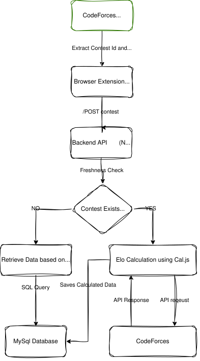

# Carrot Upgraded

Carrot Upgraded centralizes Codeforces rating prediction to reduce API load by **40,000 times** and deliver **sub-second results during live contests**.

A high-performance, cloud-native system that revolutionizes how Codeforces participants view real-time performance data and rating changes during contests.

> **Credits**: Rating calculation algorithm reverse-engineered from the excellent [Carrot extension](https://github.com/meooow25/carrot) by meooow25.

## 📊 The Problem with Existing Solutions

Traditional rating prediction tools like the original Carrot extension suffer from critical scalability issues:

### Client-Side Architecture Issues
In the original Carrot implementation:
- **Every user fetches complete contest data** directly from Codeforces API on every page refresh
- **Every user performs rating calculations** locally in their browser
- **No caching mechanism** - same data downloaded repeatedly by thousands of users

### The Scalability Crisis
Consider a typical Codeforces Div 4 contest with **~40,000 participants**:

| Metric | Original Carrot | Impact |
|--------|----------------|---------|
| **API Requests to CF** | 40,000 requests (one per user) | Massive server load on Codeforces |
| **Data Transfer** | 40,000 × 40,000 = **1.6 billion** participant records | Extremely high bandwidth consumption |
| **Client Computation** | Each user runs calculations independently | Browser performance degradation |
| **Refresh Cost** | Full re-download + re-calculation | Poor user experience |

**Real-world consequences:**
- Codeforces API gets hammered with redundant requests **during live contests**
- Users experience slow load times (10-30+ seconds)
- Browser tabs freeze during calculation
- CF servers face unnecessary load spikes during peak contest hours
- Multiple refreshes compound the problem exponentially

## 🏗️ System Architecture

#$# High-Level Architecture



### High-Level Design
The system leverages cloud infrastructure to provide a scalable, reliable service:

- **Frontend**: Chrome Extension (Manifest V3) that injects performance metrics into Codeforces standings
- **Reverse Proxy**: Nginx handles HTTPS, SSL termination, and forwards to backend
- **Backend**: Node.js Express server on AWS EC2 for API management and orchestration
- **Database**: Amazon RDS (MySQL) for persistent storage of contest results
- **Cache & Locking**: Redis for distributed locks and concurrency control

### Deployment on AWS

#### Compute & Networking
- **AWS EC2**: Hosts the Node.js application
- **Elastic IP**: Provides static IPv4 address across instance restarts
- **DNS Configuration**: Custom subdomain mapped via A-record for clean API endpoints

#### Reverse Proxy & Security
- **Nginx** configured to:
  - Accept HTTPS requests on port 443
  - Handle SSL certificate management
  - Forward to Express app on localhost:3000
  - Shield backend from direct internet exposure

#### Database Layer
- **Amazon RDS (MySQL)**: Managed database service providing:
  - Automated backups and point-in-time recovery
  - Automatic patching and updates
  - High availability and performance isolation
  - Better scalability than EC2-hosted databases

---

## ✨ How Carrot Upgraded Solves This

**Carrot Upgraded** introduces a centralized backend that acts as an intelligent intermediary between users and Codeforces:

### Architectural Transformation

```
┌─────────────────────────────────────────────────────────────┐
│                    ORIGINAL CARROT                          │
├─────────────────────────────────────────────────────────────┤
│  User 1 → CF API (fetch 40K records) → Calculate locally    │
│  User 2 → CF API (fetch 40K records) → Calculate locally    │
│  User 3 → CF API (fetch 40K records) → Calculate locally    │
│  ...                                                        │
│  User 40K → CF API (fetch 40K records) → Calculate locally  │
│                                                             │
│  Result: 40,000 API calls × 40,000 records each             │
└─────────────────────────────────────────────────────────────┘

┌─────────────────────────────────────────────────────────────┐
│                 Carrot Upgraded                             │
├─────────────────────────────────────────────────────────────┤
│                                                             │
│  Backend Server (every 5 min):                              │
│    └─→ CF API (fetch 40K records ONCE) → Calculate →        │
│         Cache in MySQL                                      │
│                                                             │
│  User 1 → Backend API → Cached Data (instant)               │
│  User 2 → Backend API → Cached Data (instant)               │
│  User 3 → Backend API → Cached Data (instant)               │
│  ...                                                        │
│  User 40K → Backend API → Cached Data (instant)             │
│                                                             │
│  Result: 1 API call to CF, 40,000 lightweight responses     │
└─────────────────────────────────────────────────────────────┘
```

### Key Improvements

#### 1. **Centralized Data Fetching**
- Backend fetches contest data **once every 5 minutes** from Codeforces
- Single point of contact with CF API reduces load by **40,000×**
- CF API requests drop from **40,000 → 1** per refresh cycle
- **Critical during live contests** when users refresh frequently to check standings

#### 2. **Server-Side Computation**
- Rating calculations performed **once on server**
- Results cached in MySQL database
- Users receive **pre-computed results instantly**

#### 3. **Massive Data Transfer Reduction**

| Scenario | Original Carrot | Carrot Upgraded | Improvement |
|----------|----------------|-----------------|-------------|
| **CF → Clients** | 40,000 × 40,000 = 1.6B records | 1 × 40,000 = 40K records | **40,000× reduction** |
| **Backend → Clients** | N/A | 40,000 lightweight responses | Minimal bandwidth |
| **Total Network Load** | Extreme | Minimal | **99.9975% reduction** |

#### 4. **Client Performance Gains**
- **No local computation** - browser stays responsive
- **Instant results** - data arrives pre-calculated from cache
- **Low memory usage** - no need to store 40K participant objects
- **Consistent experience** - no performance degradation during large contests

---

## ⚡ Advanced Optimizations

### 1. Rating Calculation Algorithm

**Credit**: The rating calculation algorithm used in Carrot Upgraded is reverse-engineered from the [original Carrot extension](https://github.com/meooow25/carrot) by meooow25, which implements an efficient FFT-based approach.

**The Algorithm**:
Both the original Carrot and Carrot Upgraded use the same core calculation method based on Fast Fourier Transform (FFT) to compute expected ranks efficiently.

For each participant, the expected rank is calculated based on win probability against all other participants:
```
Expected_Rank[i] = 0.5 + Σ(P(rating[i] beats rating[j])) for all j ≠ i
```

By recognizing that this calculation is mathematically equivalent to a **convolution** operation:
- The rating distribution is treated as a discrete signal
- FFT transforms the problem from time domain to frequency domain
- Convolution is performed in O(N log N) or O(M log M) time (M = rating range ~4000)

**Key Difference**:
- **Original Carrot**: Each client runs the FFT calculation independently in their browser
- **Carrot Upgraded**: Server runs the calculation **once** and serves results to all users

This architectural shift is what enables the massive scalability improvements.

### 2. Redis Distributed Locking

**Problem**: During live contests, when thousands of users refresh their standings pages simultaneously, we risk triggering multiple concurrent data fetches and calculations.

**Solution**: Redis-based distributed locking mechanism

```javascript
// Pseudocode
async function getContestResults(contestId) {
  const lockKey = `lock:contest:${contestId}`;
  
  // Try to acquire lock
  const lockAcquired = await redis.set(lockKey, 'processing', 'NX', 'EX', 300);
  
  if (lockAcquired) {
    // First request - do the work
    await fetchFromCodeforces(contestId);
    await calculateRatings();
    await saveToDatabase();
    await redis.del(lockKey);
  } else {
    // Subsequent requests - wait and poll
    while (await redis.exists(lockKey)) {
      await sleep(500);
    }
  }
  
  // All requests served from cached DB
  return await database.getContestResults(contestId);
}
```

**Benefits**:
- Only **one fetch** from Codeforces API regardless of concurrent users
- Prevents wasteful duplicate calculations
- Reduces CPU, memory, and network usage by **orders of magnitude**
- Guarantees consistency - all users get same calculated results

### 3. High-Performance Batch Processing

**Database Operations Optimization**:
- **Batch Inserts**: Group records into batches (e.g., 1,000 per batch)
- **Reduced Round-Trips**: Minimize network overhead to RDS
- **Transaction Efficiency**: Single transaction for multiple records

**Impact**: Initial data ingestion of 40,000 records completes in seconds rather than minutes.

---

## 📈 Performance Comparison

| Metric | Original Carrot | Carrot Upgraded |
|--------|----------------|-----------------|
| **CF API Load (Live Contest)** | 40,000 requests | 1 request (every 5 min) |
| **Data Transferred** | 1.6 billion records | 40,000 records |
| **Client Calculation** | Full calculation per user | Zero (pre-computed) |
| **Page Load Time** | 10-30+ seconds | <1 second |
| **Browser Memory** | High (all participant data) | Minimal (results only) |
| **CF Server Impact** | Extremely high | Negligible |

---

## ⚙️ Setup & Installation

### Backend Setup
1. **Install Dependencies**:
   ```bash
   npm install
   ```

2. **Environment Configuration**:
   Create a `.env` file with:
   ```
   DB_HOST=your-rds-endpoint.amazonaws.com
   DB_USER=admin
   DB_PASSWORD=your-password
   DB_NAME=carrot_db
   REDIS_HOST=localhost
   REDIS_PORT=6379
   PORT=3000
   ```

3. **Run the Backend**:
   ```bash
   node backend/master.js
   ```

### Frontend Setup
1. Navigate to `chrome://extensions/`
2. Enable **Developer mode**
3. Click **Load unpacked** and select the `frontend` folder
4. The extension will now appear in your browser toolbar

---

## 🎯 Key Takeaways

**Carrot Upgraded transforms a client-heavy architecture into an efficient cloud-native solution:**

✅ **40,000× reduction** in Codeforces API requests during live contests  
✅ **99.997% reduction** in total data transfer  
✅ **Instant loading** for end users (no client-side computation)  
✅ **Scalable infrastructure** that handles peak contest loads  
✅ **Better for everyone** - users get faster results, CF servers stay healthy

By centralizing data fetching and computation while using the same proven FFT algorithm from the original Carrot, we've built a system that scales efficiently while providing a superior user experience.

---

## 🙏 Acknowledgments

- **[Carrot](https://github.com/meooow25/carrot)** by meooow25 - For the brilliant FFT-based rating calculation algorithm that we reverse-engineered and implemented in our backend

---

## 🔗 Links

- **GitHub**: [https://github.com/Neverspot/carrot-on-cloud](https://github.com/Neverspot/carrot-on-cloud)
- **Original Carrot**: [https://github.com/meooow25/carrot](https://github.com/meooow25/carrot)
- **Codeforces**: [https://codeforces.com](https://codeforces.com)

## 📄 License

MIT License - feel free to learn from and build upon this project!
